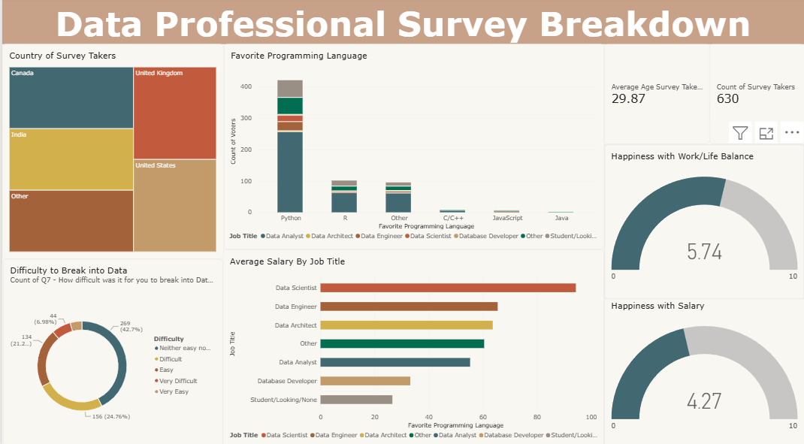

# Data Professional Survey Breakdown

A data analysis and visualization project created using Power BI to explore
survey data from data professionals.

## 🛠️ Tools & Skills

- Microsoft Power BI
- Data Analysis
- Data Visualization

## 📊 Project Overview

The project analyzes survey data from data professionals to explore trends
and patterns related to job roles, salaries, programming languages,
job satisfaction, and career-related insights.

## 🔎 Analysis

The dashboard explores different aspects of the survey data, including:

- Job Roles
- Salaries
- Programming Languages
- Job Satisfaction
- Work-Life Balance
- Career Insights

## 📈 Dashboard

The Power BI dashboard presents interactive visualizations that make the
survey results easier to explore and compare.

## 📁 Project Files

- **Data Professional Survey Breakdown.pbix** — Power BI project file
  containing the data model, visualizations, and dashboard.
- **dashboard-preview.png** — Preview of the completed dashboard.
